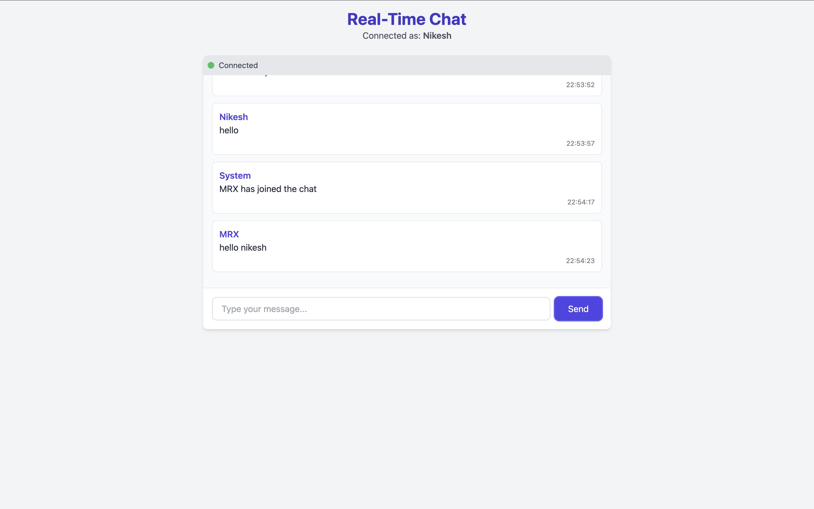

# Spring Boot Real-Time Chat Application

This is a simple real-time chat application built using **Spring Boot**, **WebSockets with STOMP**, and **SockJS**. The frontend is styled with **Tailwind CSS** and allows users to send and receive messages instantly.

---

## 🚀 Features

- Real-time messaging using WebSockets
- SockJS fallback support
- STOMP-based communication
- Lightweight, single-room chat
- Tailwind CSS-powered responsive UI
- Configurable WebSocket origin URL (via `application.properties` or environment variable)

---

## Screenshots

 <!-- Optional: Replace with actual screenshot path -->

---

## 🔧 Technologies Used

- Java 21+
- Spring Boot
- WebSocket (STOMP)
- SockJS
- Tailwind CSS (via CDN)
- Maven